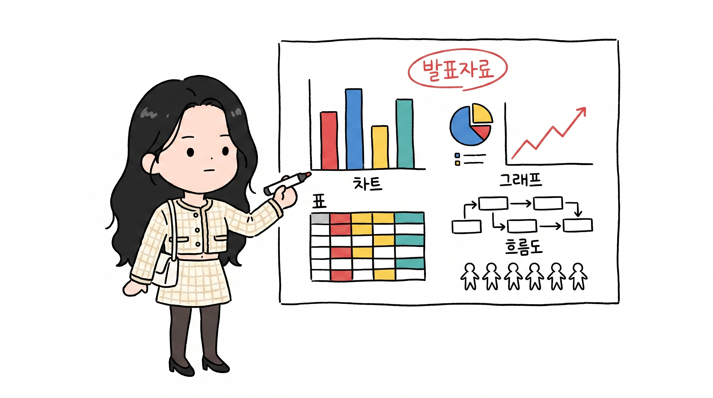
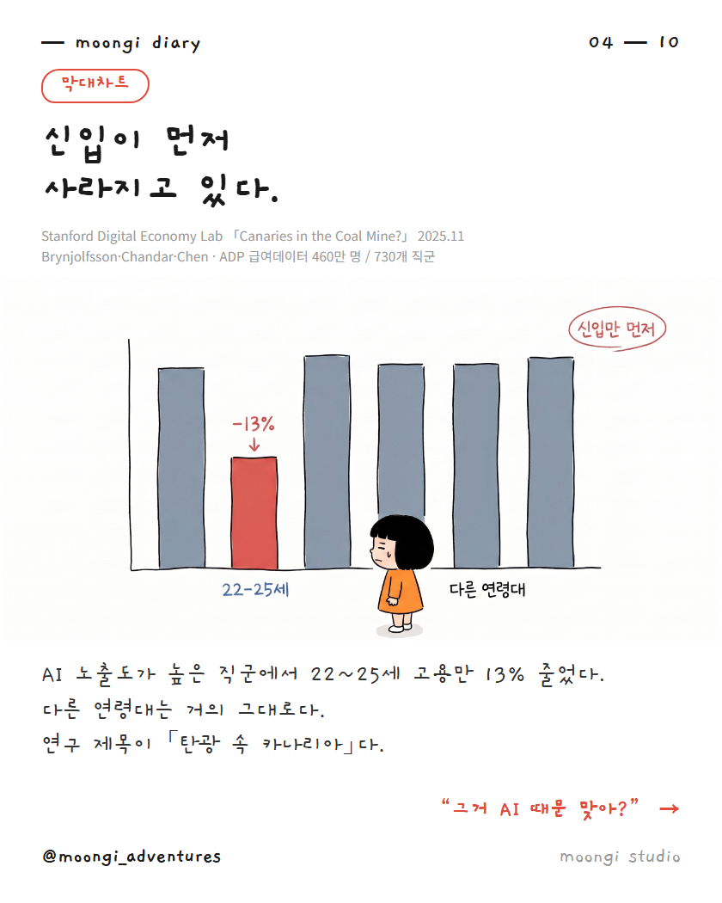
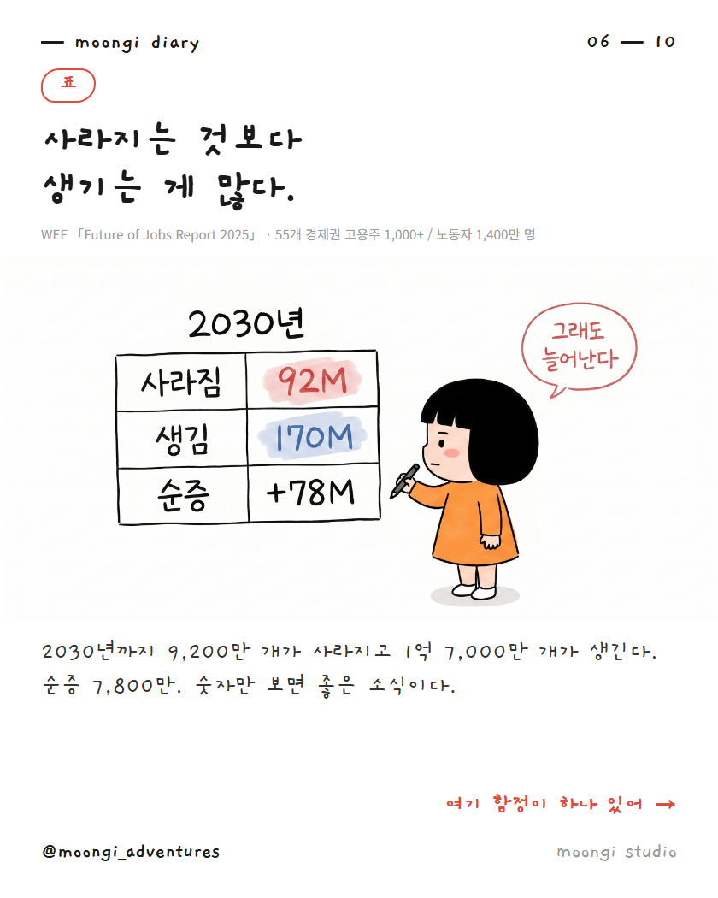

# handdrawn-ppt

**내 캐릭터 이미지 한 장이면, 손그림 발표자료를 통째로 만들어주는 Claude 스킬.**

주제를 리서치해서 **검증된 출처**까지 붙이고, 차트·그래프·표·흐름도·빅넘버 같은
PPT 요소를 전부 손그림으로 그려줍니다. 한국어·영어 둘 다 됩니다.



<p align="center">
  
  
</p>

---

## 뭐가 되나요

1. **캐릭터 변환** — 3D 피규어든 실사 사진이든 그림이든, 아무 이미지나 넣으면 손그림 캐릭터로 바꿔줍니다
2. **자료조사** — 원하는 주제를 조사하고 1차 출처(기관 원문·보고서·라이브 통계)까지 확보합니다
3. **PPT 요소 생성** — 막대차트 · 꺾은선 · 파이차트 · 표 · 흐름도 · 빅넘버 · 비교 구도
4. **완성** — 그 위에 헤드라인·설명·출처를 얹어 발표자료나 인스타 캐러셀로 조립합니다

## 선 모드 — 시작할 때 하나를 고릅니다

같은 손그림이라도 **선을 어떻게 긋느냐**에 따라 완전히 다른 물건이 됩니다.

### `rough` — 치졸한 펜 낙서

손떨림이 보이고, 선이 뚝뚝 끊기고, 모서리가 안 닫혀 있습니다. **일부러 못 그린 것처럼** 보이게 만드는 모드입니다.

- **어울리는 곳** — 인스타 캐러셀, 릴스, SNS 카드뉴스
- **왜** — 피드에서 눈에 띕니다. 매끈한 그림은 스톡 이미지처럼 보여서 스크롤에 묻히는데, 삐뚤빼뚤한 선은 "사람이 손으로 그렸네" 하고 시선이 멈춥니다
- **주의** — 정보량이 많은 슬라이드에서는 선이 어수선해 보일 수 있습니다

### `clean` — 깔끔한 라인

선 굵기가 균일하고 부드럽습니다. 대신 **여전히 손으로 그린 느낌**은 남습니다. 벡터나 클립아트로 넘어가면 실패입니다.

- **어울리는 곳** — 발표자료, 강의자료, 제안서, 블로그 삽화
- **왜** — 읽기 편하고 프로페셔널합니다. 차트·표처럼 정보가 빽빽한 슬라이드는 이쪽이 훨씬 잘 읽힙니다
- **보너스** — 실사 인물 사진을 캐릭터 참조로 쓰면 모델이 자연스럽게 clean 쪽으로 갑니다. 실사 참조를 쓸 거면 처음부터 clean으로 잡는 게 편합니다

### 지정하는 법

채팅에서 그냥 말하면 됩니다. 안 정하면 물어봅니다.

```
clean 모드로 만들어줘
선이 너무 깔끔해, rough로 다시
```

> **한 자료 안에서는 섞지 마세요.** 슬라이드마다 선 느낌이 달라지면 전체가 조잡해 보입니다.
> 모드를 먼저 확정하고 끝까지 그걸로 갑니다.

---

## 설치

### Claude Code — 이게 제일 쉽습니다

폴더를 직접 찾아 들어갈 필요 없습니다. **Claude Code 채팅에 아래를 그대로 붙여넣으세요.**

```
https://github.com/moongiadventures-dev/handdrawn-ppt
이 저장소를 내 스킬 폴더에 클론해줘. 끝나면 뭘 해야 하는지 알려줘.
```

Claude가 스킬 폴더 위치를 알아서 찾아 클론합니다. 끝나면 **Claude Code를 껐다 켜세요.**
새 스킬은 재시작해야 인식됩니다. `/handdrawn-ppt` 를 쳤을 때 뜨면 성공입니다.

<details>
<summary>수동으로 설치하고 싶다면</summary>

`Code → Download ZIP`으로 받아서 압축을 풀고, 폴더째로 아래 위치에 넣습니다.

| OS | 넣을 위치 |
|---|---|
| macOS / Linux | `~/.claude/skills/handdrawn-ppt/` |
| Windows | `C:\Users\<사용자이름>\.claude\skills\handdrawn-ppt\` |

폴더를 열었을 때 `SKILL.md`가 바로 보이는 구조여야 합니다.

```
.claude/skills/handdrawn-ppt/
├── SKILL.md
└── references/style_lock/*.png
```

`.claude` 폴더가 안 보이면 숨김 폴더 표시를 켜세요.
(Windows: 탐색기 → 보기 → 숨긴 항목 / Mac: `Cmd + Shift + .`)

</details>

### claude.ai(웹)에서 쓰기

웹에서는 클론이 안 되니 `SKILL.md` 파일 하나만 Settings → Capabilities → Skills 에서 업로드합니다.
(파일 맨 위 `--- name / description ---` 블록이 있어야 업로드됩니다. 이 저장소 파일엔 이미 들어 있습니다.)

참조 이미지는 같이 안 올라가니, 첫 컷을 뽑은 뒤 그 컷을 앵커로 삼아 이어가면 됩니다.

---

## 준비물 — 이미지 생성기

이 스킬은 **글로 지시하는 설명서**입니다. 실제로 그림을 그리는 건 이미지 생성 모델이라,
Claude가 호출할 수 있는 이미지 생성 수단이 하나 필요합니다.

**권장: Google Gemini (Nano Banana Pro)** — 참조 이미지를 여러 장 동시에 물릴 수 있어서
캐릭터 일관성이 제일 잘 잡힙니다.

1. [Google AI Studio](https://aistudio.google.com/apikey)에서 API 키를 발급받습니다
2. 키를 환경변수 `GOOGLE_API_KEY`로 저장합니다 (Claude Code라면 `~/.claude/.env`에 한 줄)

```
GOOGLE_API_KEY=발급받은_키
```

3. 이미지 생성 스크립트를 쓰는 스킬(예: `nano-banana-pro`)을 같이 설치합니다

> OpenAI `gpt-image-2` 등 **참조 이미지를 받는 모델이면 무엇이든** 됩니다.
> 이미지 생성 수단이 아예 없으면, 스킬이 완성된 프롬프트와 참조 이미지 목록을 정리해줍니다.

---

## 쓰는 법

터미널 명령어를 외울 필요 없습니다. **채팅에 이렇게 치면 됩니다.**

### 1. 캐릭터부터 정하기

```
/handdrawn-ppt
[내 캐릭터 이미지 첨부]

이 캐릭터로 갈게. 정면/측면 있으면 더 좋아.
```

캐릭터 이미지는 3D 피규어, 실사 사진, 일러스트 아무거나 됩니다.
없으면 "캐릭터부터 만들어줘"라고 하면 만들어 줍니다.

### 2. 자료 만들기

```
"AI가 일자리에 미치는 영향"으로 발표자료 8장 만들어줘.
clean 모드로, 출처 꼭 넣어줘.
```

그러면 이 순서로 진행됩니다.

1. 주제를 조사하고 **팩트 표**를 먼저 보여줍니다 → 숫자와 출처를 확인해 주세요
2. 캐릭터 락 컷을 한 장 뽑습니다 → 마음에 드는지 확인
3. 슬라이드별로 그림을 그립니다
4. 헤드라인·설명·출처를 얹어 조립합니다

### 유용한 지시들

```
막대차트 슬라이드로 만들어줘
표로 정리해줘
이 숫자를 크게 강조하는 슬라이드로
캐릭터 표정이 상황이랑 안 맞아, 다시
선이 너무 깔끔해, rough로 다시 뽑아줘
16:9로 뽑아줘 / 4:5로 뽑아줘
```

---

## 알아두면 좋은 것

이 스킬을 실제로 굴리면서 반복해서 겪은 문제들입니다. SKILL.md 안에 규칙으로 들어가 있습니다.

- **캐릭터가 자꾸 웃습니다.** 놔두면 모델이 무조건 웃는 얼굴을 그립니다. 정리해고 얘기에 캐릭터가 방긋 웃고 있으면 그림이 내용을 배신합니다. 장면 감정별 표정 지정 문구가 들어 있습니다.
- **여러 장 뽑으면 얼굴이 조금씩 달라집니다.** 자기 출력을 계속 참조로 물리면 오차가 복리로 쌓입니다. 승인된 컷 하나를 앵커로 잡고 매번 거기서 새로 뽑아야 합니다.
- **한글은 짧아야 안 깨집니다.** 그림 안 글자는 2~6자까지. 숫자와 영문은 거의 안 깨지니 수치는 마음껏 넣으세요.
- **긴 설명은 그림에 넣지 마세요.** 오타 하나에 다시 뽑아야 합니다. 그림엔 숫자와 짧은 라벨만, 문장은 바깥에서 얹는 게 맞습니다.
- **캐릭터 색을 강조색으로 쓰지 마세요.** 캐릭터가 배경에 묻힙니다.

---

## 크레딧

화풍의 원형은 [EverettFish/ip_illustration_for_yourself](https://github.com/EverettFish/ip_illustration_for_yourself)에서 왔습니다.
핵심 프롬프트 문장과 "거친 펜선 · 미니 구도 · 콩눈" 화풍 정의가 그 저장소의 것입니다.

이 저장소는 거기서 갈라져 나와 아래를 새로 만들었습니다.

- 한국어 운용 (주석 정책, 한글 안전 규칙, 한국 맥락 변환)
- 자료조사 단계 — 출처 등급, 1차 출처 확인, 발간연도 검증, 반론 슬라이드
- `rough` / `clean` 두 가지 선 모드
- 표정 규칙 (장면 감정별 지정)
- 캐릭터 드리프트 방지 (편집 체인, 정면 컷 락)
- 팔레트 규칙 (캐릭터 색 독점)
- 비율을 쓰일 자리에 맞추는 규칙
- 포함된 참조 이미지 전부 (이 저장소에서 직접 생성)

원본 저장소의 이미지·파일은 이 저장소에 **포함되어 있지 않습니다.**

made by [@moongi_adventures](https://instagram.com/moongi_adventures) · MOONGI Studio
